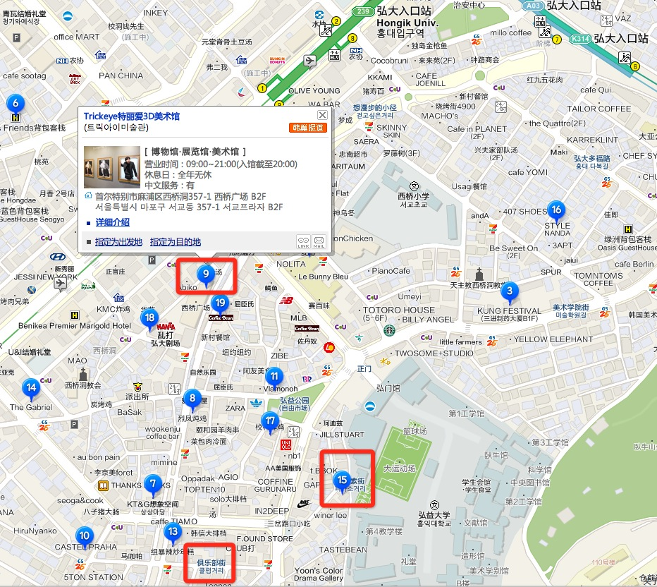

# 综述
taobao UED outing 韩国行自由行小分队，因姑娘是2pm、f(x)、miss A等各种团的饭，我们小分队取名miss U，U取自UED、UX,同时miss U有miss you之意:)

# miss U（韩文名称：미스유이）
* 妙净（먀징）：韩语担当，业余学了8个月，问路应该ok，其他靠app神器
* 安昵（안니）：英语担当，留澳三年，英语no problem!
* 紫溪（지시）：身高担当，167媲美miss A、f(x)、少时等组合的成员,拉风！
* 灵吾（린우）：人妖兼力气担当，拎所有东西，其实是真汉子:)

四人组队差不多，方便打的，不易走散~

# 前期大致分工
1. 安昵看看什么东西好吃，虽然咱们走到哪里吃到哪里，综合把控出国的各种注意事项
2. 灵吾负责搞定wifi40块一天租用，还有插座转接口10块钱，还有T-money是可以提前网上买
3. 妙净负责自由行路线搜罗把常用语再背一遍，准备好地图翻译等软件
4. 紫溪负责搜罗什么东西值得买,具体到型号，最好有截图，大概长成什么样子 呵呵    

# 想买的
1. 手膜和脚膜
2. 韩国美白牙膏
3. 国产007牌美甲工具套餐 好专业漂亮 大概50块一套
4. 韩国小吃好吃（小鱼饼）
5. 韩国的冰箱贴很漂亮也很精致
6. IU等韩星宣传海报
7. 泡菜、辣椒酱

## 想买的 -- 化妆品篇

1. 悦诗风吟 innisfree 绿茶籽精华 / 火山泥面膜 / 胶囊面膜 / 片状面膜 / 绿茶睡眠面膜 / 绿茶眼霜 （全部必买）
2. 伊恩 It's skin - 蜗牛霜 （白/红）/ Q10精华系列 （必买）

3. 赫拉 Hera - 气垫BB 色号N21 （必买） / 震动散粉
4. 亦博 IOPE - 气垫BB UV mist cushion
5. 兰芝 Laneige - 气垫BB snow BB soothing cushion/ 睡眠面膜（必买）
6. 谜尚 Missha - BB霜（红罐，色号21）
7. Dr jart+ BB霜 （银罐）
8. 自然乐园 Nature Republic - 芦荟胶 （必买)
9. Holika Holika 米酒面膜 / 眼影笔 
10. 魔法森林 Tony Moly - 蜜桃护手霜、唇彩 / 七公主唇彩
11. 艾丽小屋 Etude House - 小动物护手霜 蜗牛面膜 西红柿面膜
12. 思亲肤 Skin food - 罐装面膜
13. too cool for school - 唇笔 棉棒 鸡蛋面膜

14. sisley希思黎 全能乳液

15. HOLIKA HOLIKA 带刷泡沫洗面奶

16. 猪鼻子去黑头鼻贴膜

17. TOO COOL FOR SCHOOL家的棉签棒
18. 自然乐园的蛇毒面膜  去皱保湿 弹性营养    
19. 悦诗风吟 innisfree 的面膜
95o元韩币 一张，如果在免税店买还可以更优惠呢
绿茶面膜：绿茶主打保湿，自然补水效果显著。而且用后精华液吸收超级快，不粘腻，很舒服。味道也很清新，但不知道为何转天lz起了个痘痘呢？难道我真的 用不了过于保湿的东东吗

芦荟面膜：这款我用着觉得要比绿茶更适合我一些。因为芦荟的主打 修复和保湿。用后感觉要比绿茶的更清爽。貌似眼角的小细纹 有所好转呢 哈哈 
 ps：他家面膜 价格不贵 但是免税店 一卖就是10片一样的一包，不利用各种尝试，但街边专卖店，可以单独购买，建议mm们 ，选几张喜欢的，先试试，哪个适合自己再去专卖店大批购买，价格也别专卖店便宜点

20. hanskin的招牌黑管bb  rmb150-170元

21. 爱丽小屋 珠光粉饼  提亮效果还是满意的。价格也很白菜，免税店12美金

# 要去的
<table>
	<tr><th>日期时间</th><th>行程内容</th><th>备注</th></tr>
	<tr><td>7月3日</td><td>上海-金浦（18：15-21：15）</td><td>跟着大家走</td></tr>
	<tr><td>7月4日</td><td>景福宫-民俗博物馆-青瓦台-清溪川-南山公园-乐天世界</td><td>跟着大家走</td></tr>
	<tr><td>7月5日</td><td>人参公卖局-化妆品店-护肝宝-明洞-DFS-东大门-华克山庄</td><td>跟着大家走</td></tr>
	<tr><td>7月6日</td><td>弘大-梨大-清潭洞（含SM JYP公司）-清沙洞林荫道-盘浦大桥-回宾馆</td><td>自由行</td></tr>
	<tr><td>7月7日</td><td>宾馆附近的超市逛逛，午餐后【土特产商店】- 回航</td><td></td></tr>
</table>
# 4/5日晚上韩式汗蒸幕 happyday spa
http://www.visitkorea.or.kr/chs/SI/SI_CHG_2_1_1_1.jsp?cid=1119257
* 位置	首尔麻浦区西桥洞371-10 Kyu Soo Dang婚礼厅地下1层（서울 마포구 서교동 371-10 규수당웨딩홀 지하 1층）
* 交通   弘大附近  如下图 1.地铁2号线弘大入口站5号出口，步行5分钟(位于Kyu Soo Dang婚礼厅地下1层)  2.地铁2、6号线合井站3号出口，步行5分钟(位于Kyu Soo Dang婚礼厅地下1层)
* 价格   桑拿 夜间(20:00~05:00) - 成人 7,000韩元 汗蒸房 夜间(20:00~05:00) - 成人 8,000韩元
* 介绍   Happyday Spa位于弘大入口站与合井站之间的Kyu Soo Dang婚礼厅地下1层，是一处具有3层规模的SPA。地下1层为男/女专用桑拿、Spa设施及更衣室，地下2层和3层则为盐浴、黄土、氧气、木炭等主题不同的汗蒸房和冰房，除此之外，这里还有大型的电视屏幕，供游客休息娱乐，以及各种饭店、零食吧、男/女睡眠室、电脑房、皮肤按摩室等附带设施。特别是，这里是日本有名杂志曾介绍过的韩国旅游体验名所，因此来这里的日本游客居多。

# 自由行当天具体线路
因为前2天市中的景点基本都去过了，我们以从宾馆出发路过梨大到江南区为主。满足各种淘货吃货、一睹江南style、访韩娱经纪公司、漫步于艺术调调的林荫道上，最后去感受下大韩民国的母亲河,除了宾馆，每个景点都是韩剧拍摄地，哈哈:)

	斯坦福宾馆 - 弘大 - 梨大 - 狎鸥亭∙清潭洞 - 清沙洞林荫道 - 盘浦大桥 - 回宾馆

<table>
	<tr><th>时间点</th><th>目的地</th><th>换乘路线</th><th>重要景点</th><th>车时、总车费5550</th></tr>
	<tr><td>8：00出发</td><td>弘大 (홍대)</td><td>酒店坐Bus到DMC（Digital Media City Metro Station），坐AirportRailroad弘大下或者水色站(수색역)坐Gueongui到弘益大学</td><td>弘大壁画 弘大购物街</td><td>10分钟、1050韩币</td></tr>
	<tr><td>11:00</td><td>梨大 (이화여자대학교)</td><td>在弘大乘坐2号线经过新村到达梨大，如果时间够就直接从新村走到梨大</td><td>梨大校园 梨大购物美食街 中饭梨大解决</td><td>4分钟、1050韩币</td></tr>
	<tr><td>14:00</td><td>清潭洞(청담동)</td><td>梨大坐2号线到建大入口(건대입구역)换乘7号线（最快换乘点3-2号车厢）到清潭站(청담역)下</td><td>狎鸥亭∙清潭洞(압구정・청담동)步行到清沙洞林荫道途经（JYP娱乐公司、清潭洞名品街、SM娱乐公司、Galleria百货公司、整容一条街、现代百货公司、到达新沙洞林荫道）</td><td>37分钟、1150韩币</td></tr>
	<tr><td>16：00</td><td>清沙洞林荫道（신사동 가로수길）</td><td>步行</td><td>下午茶+晚餐，休闲+美食+艺术</td><td>0韩币</td></tr>
	<tr><td>20：00</td><td>盘浦大桥(반포대교)</td><td>新沙站(신사역)坐3号线经过2站到达高速巴士客运站(고속터미널)8-2號出口在高速巴士客運站十字路口右轉，沿著盤浦路往盤浦大橋方向直走，從地下道進入，至月光彩虹廣場(달빛광장)欣賞</td><td>正好星期六: 12:00 / 17:00 / 19:30 / 20:00 / 20:30 / 21:00 / 21:30 有月光彩虹喷泉、看看汉江（한강）</td><td>4分钟、1050韩币</td></tr>
	<tr><td>22：00回宾馆</td><td>斯坦福宾馆</td><td>高速巴士客運站坐3号线经过六站到药水站(약수역)（最快换乘点4-3号车厢）坐6号线到数码媒体城(디지털미디어시티역)（2-2号车厢）坐京义线（경의선）到水色</td><td>一路沿着汉江回来，可以看看63大厦等</td><td>1小时、1250韩币</td></tr>
</table>
## 弘益大学景点详图

毕加索街涂鸦 - 附近的3D美术馆 - 俱乐部
## 梨花女子大学景点详图

地铁2号线在梨大湛下车，2号或3号口出来，步行前往，到梨大门口有一条女人街，很多特色小店，附近也很多甜点和餐馆，梨大的校园很美
## 狎鸥亭∙清潭洞步行路线详图

1. JYP娱乐公司(JYP엔터테인먼트) --》 
2. 清潭洞名品街 --》
3. SM娱乐公司(SM엔터테인먼트) --》
4. Galleria百货公司(갤러리아 백화점) --》
5. 整容医院一条街 --》
6. 现代百货公司（현대백화점） --》
7. 新沙洞林荫道（신사동 가로수길）

## 盘浦大桥回酒店路线图

## 斯坦福宾馆附近地图

首尔仕德福酒店 (스탠포드호텔 서울)
02-6016-0001
首尔特别市麻浦区上岩洞 1587(서울특별시 마포구 상암동 1587)

# 中韩地图
http://map.cn.konest.com/darea/13

# 路上美食篇
* 八色烤肉在新村附近，周边很多大学。大学周边的饮食价格都会比较实惠一些
* 部队锅 连锁店 到处都是
* Mango Six 到处都有的连锁饮品甜品店 韩剧出镜率高
* 姜虎东烤肉 连锁店 到处都是

# 景点介绍
* 必看景点--盘浦大桥彩虹喷泉 http://blog.sina.com.cn/s/blog_9e1a09100101bhjq.html
* 狎鸥亭∙清潭洞 http://cn.konest.com/contents/area_detail.html?id=4
* 弘大 梨大
* 北村 仁寺洞

# 交通
* 做黄色公交：950每人 
* 地铁 900 主要以地铁出行为主：首尔地铁运行时间为凌晨5点至夜间1点
* taxi: 2km以内2400韩元 超过2km以后每144m加收100韩元。以低于时速15km的速度行驶时，每35秒加收100韩元。00 :00~04 :00之间乘车时需多支付20%的深夜附加费。
* 观光巴士：市區循環路線 10,000（约53人民币）
* T-money 公交卡  到处可以刷卡 必须一人一张 已经淘宝上买好

# 旅游用语
以备不时之需，妙净打印,手机有电子稿，韩语是音表文字，好念
http://visitkorea.or.kr/cht/CU/CU_CH_3_2_7_5.jsp

# 通讯
wifi egg和插座转接头灵吾已经淘宝上买好搞定
 
# 备忘录
雨具，换洗衣服，毛巾，洗漱用品，接线板，钱包，移动电源，打印机票行程单，复印身份证，护照本，地铁路线图（人手一份）

# 其他
1. 建议带一个零钱包，里面赚平时买零食或者吃饭的钱，买大件的时候再拿钱包，避免掏来掏去的。    
2. 建议把护照 身份证 等证件复印一下，不怕一万，就怕万一，放身上一份，箱子里一份。    
4. 建议T-MONKY卡钱不要充太多，因为不能退，你可以先充100，如果只是坐地铁应该够了。    
5. 各种优惠卷可以去易八达以及韩国旅游发展局的网站上打印。    
6. 带大的接线板

